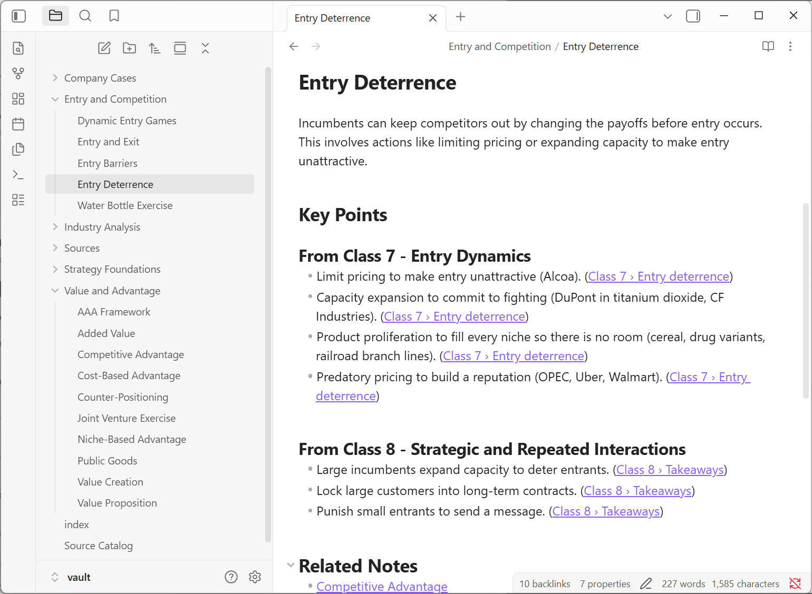
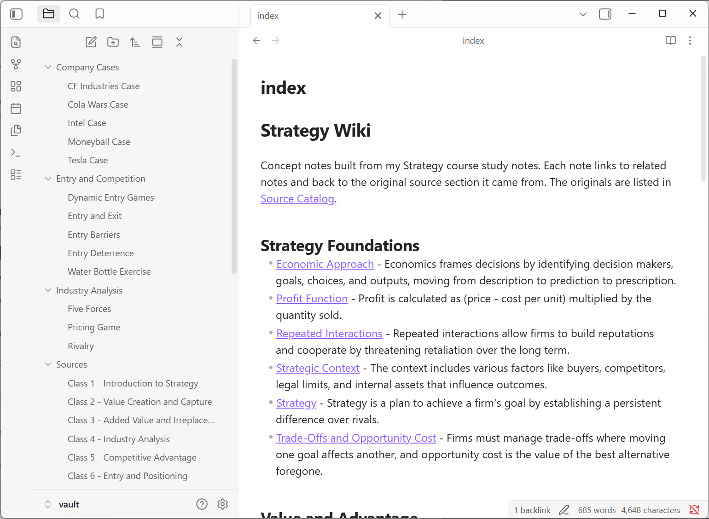
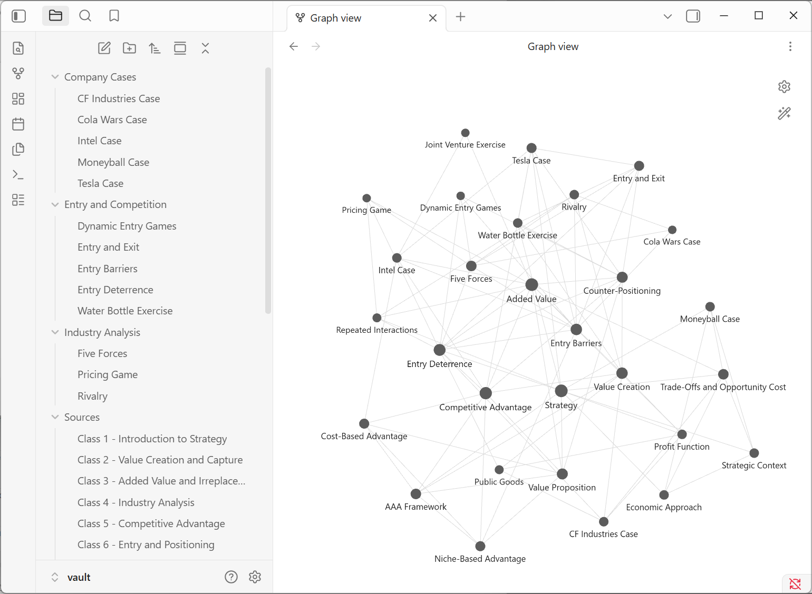

# Personal Strategy Wiki CLI (local Gemma + RAG)

Assignment 4, Class 5 (Agentic AI). A command-line personal wiki that runs entirely on my laptop:
a local open-weight **Gemma** model answers questions about my own notes using retrieval-augmented
generation (RAG), with citations, and says so when the notes do not contain the answer.

- **CLI:** [`wiki.py`](wiki.py) with `help`, `chat`, `ask`, `search`, `ingest` (plus `rebuild`, `status`)
- **Harness:** [`wikicli/harness.py`](wikicli/harness.py), [`wikicli/ingest.py`](wikicli/ingest.py), [`wikicli/retrieval.py`](wikicli/retrieval.py), [`wikicli/llm.py`](wikicli/llm.py)
- **Wiki (Obsidian vault):** [`vault/`](vault) — start at [`vault/index.md`](vault/index.md) and [`vault/Source Catalog.md`](vault/Source%20Catalog.md)
- **Offline evidence:** [`evidence/offline/transcript.md`](evidence/offline/transcript.md)

Everything reported below was measured on my machine. Nothing is invented; where something
failed, the failure and the fix are documented in [Failures and fixes](#failures-and-fixes).

---

## 1. Device, model and runtime

| | |
|---|---|
| OS | Windows 11 Home 64-bit (10.0.26200) |
| CPU | Intel Core Ultra 9 288V (Lunar Lake), 8 cores / 8 threads |
| Memory | 31.6 GB unified memory, shared with the integrated GPU (8-12 GB free during testing) |
| GPU | Intel Arc 140V integrated graphics, no dedicated VRAM. Ollama ran the model **on the CPU** (`gpu_gb: 0.0`) |
| Disk | 737 GB free |
| Runtime | [Ollama](https://ollama.com) 0.34.4, serving on `http://127.0.0.1:11434` |
| Chat / ask / ingest model | **`gemma4:e2b`** — Gemma 4 E2B, 5.1B parameters, **Q4_K_M** quantization, 7.2 GB download (Ollama digest `7fbdbf8f5e45`) |
| Embedding model | **`embeddinggemma`** — EmbeddingGemma, 307.58M parameters, BF16, 621 MB, 768-dim vectors (digest `85462619ee72`) |
| Python | 3.12.10 with `ollama`, `rank-bm25`, `numpy`, `psutil`, `pypdf` ([`requirements.txt`](requirements.txt)) |

Model weights are **not** in this repository. Official downloads: <https://ollama.com/library/gemma4:e2b>
and <https://ollama.com/library/embeddinggemma> (`ollama pull gemma4:e2b`, `ollama pull embeddinggemma`).
Gemma documentation: <https://ai.google.dev/gemma/docs>.

### Choosing the model: E2B vs E4B vs 26B A4B MoE

| Option | What it is | Size at Q4 on my machine | Verdict for a 32 GB shared-memory laptop |
|---|---|---|---|
| **E2B** | "Effective 2B": behaves like a ~2B model, but the file also holds per-layer embeddings, 5.1B parameters in total | **7.2 GB (measured)** | **Chosen.** Already fits with room to spare and is the fastest |
| E4B | Same design at ~4B effective parameters | ~10 GB (estimate, not downloaded) | Would fit, better at instruction following, but only ~10 GB was free at setup time |
| 26B A4B MoE | Mixture-of-experts: 26B total parameters, ~4B *active* per token | ~16-18 GB (estimate, not downloaded) | Skipped. Active parameters set the *speed*, not the *memory*: all experts must be loaded, which leaves too little headroom when memory is shared with Windows and the GPU |

I chose **E2B Q4_K_M**. The trade-off is real: E2B is weaker at following citation rules, which is
why the harness (not the model) enforces them; see section 6.

### Measured memory and response time (offline run, my wiki)

From [`evidence/offline/summary.json`](evidence/offline/summary.json):

| Measurement | Value |
|---|---|
| Ollama-reported allocation | `gemma4:e2b` 6.87 GB + `embeddinggemma` 0.68 GB, 0 GB on GPU |
| Peak memory of the runtime processes (`ollama` + `llama-server`) | 4.37 GB working set, 5.07 GB private |
| Peak system RAM in use during the run | 24.2 GB of 31.6 GB (includes everything else running) |
| Generation speed | 17-18 tokens/s |
| `search` | 0.1 s retrieval (1.3-1.4 s including Python start-up) |
| `ask` (answered) | 7.8 s, 20.9 s, 33.5 s for Q2, Q1, Q3 (two model calls each) |
| `ask` (refused by the answerability gate) | 2.4 s |
| `chat` | 1.8-9.4 s per turn |
| `ingest` of a new source | 49 s offline for Class 8; 60-95 s per source for Classes 1-7 |
| Re-ingest of an unchanged source | under 0.1 s, no model call |

---

## 2. Setup and launch

```powershell
# 1. Install Ollama (https://ollama.com/download) and pull the models (one time, online)
ollama pull gemma4:e2b
ollama pull embeddinggemma

# 2. Python environment (Python 3.12)
python -m venv .venv
.\.venv\Scripts\python.exe -m pip install -r requirements.txt

# 3. Use the CLI (works with the internet disconnected)
.\.venv\Scripts\python.exe wiki.py help
.\.venv\Scripts\python.exe wiki.py status
.\.venv\Scripts\python.exe wiki.py ingest "inbox/My New Source.md"
.\.venv\Scripts\python.exe wiki.py search "counter-positioning incumbent retaliate"
.\.venv\Scripts\python.exe wiki.py ask "What are the three sources of competitive advantage?"
.\.venv\Scripts\python.exe wiki.py chat

# 4. Re-run the full test suite and the link check
.\.venv\Scripts\python.exe scripts\run_checks.py --label my-run
.\.venv\Scripts\python.exe scripts\check_links.py
```

On macOS/Linux use `.venv/bin/python` instead of `.\.venv\Scripts\python.exe`.

| Command | What it does |
|---|---|
| `help` | Lists the modes and chat commands |
| `chat` | Conversation with "Atlas", a personal assistant with a personality and conversation memory. Casual questions and drafting do not trigger a notes lookup. Inside chat: `/ask`, `/search`, `/notes`, `/reset`, `/exit` |
| `ask "..."` | Standalone, neutral factual answer built only from retrieved passages, with `[S#]` citations, or an explicit *insufficient evidence* reply |
| `search "..."` | Returns the original passages, file paths, sections and scores. No generated answer |
| `ingest <path>...` | Preserves the original in `vault/Sources/`, drafts linked concept notes with Gemma, rebuilds the index pages and the retrieval index |
| `rebuild` | Re-applies naming rules and [`curation.json`](curation.json), re-renders notes and links, reindexes. No model calls |
| `status` | Model, runtime, device, index size, and whether the internet is reachable |

**Local mode is the only mode.** [`wikicli/llm.py`](wikicli/llm.py) refuses any model host that is not
`localhost`/`127.0.0.1`, so there is no cloud fallback. The optional online mode was not implemented.

---

## 3. Retrieval tool vs RAG workflow vs harness

These are three different things in this project:

1. **The retrieval tool** ([`wikicli/retrieval.py`](wikicli/retrieval.py)) only finds text. It splits every
   source and note into section-sized chunks, scores them against a query with BM25 (keywords) and
   EmbeddingGemma cosine similarity (meaning), merges the two rankings with reciprocal rank fusion, and
   returns passages with their paths. `search` mode is this tool on its own.
2. **The RAG workflow** is one use of that tool: retrieve passages, put them in the prompt, and have
   Gemma write an answer from them. RAG supplies context at inference time. **It does not retrain
   Gemma**; the model's weights never change, which is why deleting a source from the index removes
   the model's ability to answer about it (Q3 below is refused before Class 8 is ingested and
   answered after).
3. **The harness** ([`wikicli/harness.py`](wikicli/harness.py)) is the connecting code that decides *what the
   model sees and what the user gets*:

| Responsibility | How the harness does it |
|---|---|
| Mode selection | `wiki.py` routes subcommands and chat slash-commands to `Harness.chat / ask / search / ingest` |
| Instructions | Separate prompt files: [`prompts/assistant.md`](prompts/assistant.md) (chat persona) vs [`prompts/research_rules.md`](prompts/research_rules.md) (ask rules) vs [`prompts/ingest_rules.md`](prompts/ingest_rules.md) (note drafting) |
| Conversation context | Chat keeps a rolling history (last 12 messages). Ask builds its prompt from scratch every time and never receives chat history |
| Optional retrieval | Chat retrieves only when the message refers to notes ("in my notes", "lecture", ...) or uses `/notes`; ask always retrieves |
| Model calls | All calls go through `LocalModel` (temperature, context size, JSON schema, timing, token counts) |
| Evidence gates | (a) refuse without generating if nothing is even loosely related; (b) an answerability check before drafting; (c) the research rules let the answer step refuse |
| Citations | Parses `[S#]` tags, rejects tags that do not match a retrieved passage, retries once with feedback, then refuses rather than show an uncited answer; maps each tag to file path and section |
| Errors | Friendly messages for Ollama not running, model not installed, missing index, unsupported file types, conflicting source names |
| Saved outputs | Every ask, search, ingest and chat turn is saved as `.md` and `.json` under [`outputs/`](outputs), including retrieved passages, checks, timing and memory |

**Why retrieval matters:** Gemma E2B has never seen my notes. Without retrieval it can only guess from
general knowledge; with retrieval, each claim can be traced to a passage I can open. **How citations
can be checked:** every `[S#]` maps to a file and section printed under the answer and saved in
`outputs/ask/*.json` with the full passage text, so a reader can compare claim and passage directly
(I do this in section 6). **Why missing evidence should lead to an honest limitation:** a confident
answer built from unrelated passages looks exactly like a good answer, which is the failure I hit
first (section 8, failure 2).

---

## 4. The wiki

### Sources

Eight original sources, preserved unchanged in [`vault/Sources/`](vault/Sources): my own study notes, one per
lecture of my MBA Strategy course (Spring 2026), written in my own words with AI drafting help and
reviewed by me. The instructor's lecture slides are **not** redistributed here.

Source catalog ([`vault/Source Catalog.md`](vault/Source%20Catalog.md)):

| Source | Concept notes drawn from it |
|---|---|
| Class 1 - Introduction to Strategy | Economic Approach, Moneyball Case, Strategic Context, Strategy, Trade-Offs and Opportunity Cost |
| Class 2 - Value Creation and Capture | CF Industries Case, Profit Function, Public Goods, Value Creation |
| Class 3 - Added Value and Irreplaceability | Added Value, Intel Case, Joint Venture Exercise |
| Class 4 - Industry Analysis | Cola Wars Case, Entry Barriers, Five Forces, Rivalry |
| Class 5 - Competitive Advantage | AAA Framework, Competitive Advantage, Cost-Based Advantage, Niche-Based Advantage, Value Proposition |
| Class 6 - Entry and Positioning | Counter-Positioning, Entry and Exit, Tesla Case, Water Bottle Exercise |
| Class 7 - Entry Dynamics | Counter-Positioning, Dynamic Entry Games, Entry Deterrence |
| Class 8 - Strategic and Repeated Interactions *(ingested offline)* | Added Value, Entry Deterrence, Pricing Game, Repeated Interactions |

### Structure

```
vault/
  index.md                      grouped by topic
  Source Catalog.md             sources -> notes
  Sources/                      8 originals (never edited)
  Strategy Foundations/         6 notes     e.g. Strategy.md, Profit Function.md
  Value and Advantage/          10 notes    e.g. Added Value.md, Counter-Positioning.md
  Industry Analysis/            3 notes     e.g. Five Forces.md
  Entry and Competition/        5 notes     e.g. Entry Deterrence.md
  Company Cases/                5 notes     e.g. Intel Case.md, Tesla Case.md
.index/                         machine data, outside the vault
  manifest.json                 source hashes, note IDs, which source each point came from
  chunks.jsonl, embeddings.npy  retrieval chunks and vectors
```

- 29 concept notes with **short descriptive filenames that match their headings** (`Added Value.md` → `# Added Value`).
- Machine IDs (`note_id`, source hashes) live only in front matter and `.index/`; retrieval chunks live in `.index/`.
- Every key point links to the **exact section** of the original it came from; every note has related-note links and a sources list.
- Link check ([`evidence/link_check.txt`](evidence/link_check.txt), from [`scripts/check_links.py`](scripts/check_links.py)): **370 links, 0 broken, no duplicate filenames, no orphan notes, no note without a source link.**

### Obsidian screenshots

Graph filter used: `-path:Sources -file:index -file:"Source Catalog"`, attachments hidden.

| | |
|---|---|
| 1. An open note: short filename, matching heading, source references, related-note links |  |
| 2. Topic-organized page list / index |  |
| 3. Graph view of curated notes with readable labels |  |

### Tracing one note back to its evidence

1. Open [`Entry Deterrence`](vault/Entry%20and%20Competition/Entry%20Deterrence.md). Its key point "Capacity expansion to commit to fighting (DuPont in titanium dioxide, CF Industries)" links to `Class 7 › Entry deterrence`.
2. Its **Related Notes** include [`Counter-Positioning`](vault/Value%20and%20Advantage/Counter-Positioning.md), which draws on two sources; its point "The first attempt was an undifferentiated direct attack ... and drew retaliation" links to `Class 7 › Case - Ryanair, second entry`.
3. Following that link lands in the original, [`Class 7 - Entry Dynamics`](vault/Sources/Class%207%20-%20Entry%20Dynamics.md), section "Case - Ryanair, second entry", which states: "The first attempt was an undifferentiated direct attack with a murky target customer and drew retaliation". The original is byte-identical to what was ingested (SHA-256 recorded in `.index/manifest.json`).

### Re-ingestion does not create duplicates

Ingest keys every source by SHA-256 and renders notes from the manifest, so an unchanged source is a
no-op and a changed source replaces its own contribution. From the offline run:

```text
> python wiki.py ingest "inbox/Class 8 - Strategic and Repeated Interactions.md"     (second time)
  unchanged since last ingest; no notes created or modified
duplicate_check: {"files_before": 39, "files_after": 39, "new_files": []}
```

---

## 5. Test questions: retrieved passages

All results in sections 5-7 are from the **offline** run
([`evidence/offline/transcript.md`](evidence/offline/transcript.md)). Full passage text for each
question is saved in the linked output files.

**Q1 (answerable):** *In the joint venture exercise, what is Firm A's added value, and what range of payoffs should Firm A expect?* — [saved output](outputs/ask/20260929-223502-in-the-joint-venture-exercise-what-is-firm-a-s-a.md)

| Tag | Path › section | Kind | Cosine | BM25 |
|---|---|---|---|---|
| S1 | vault/Value and Advantage/Joint Venture Exercise.md › Key Points | note | 0.635 | 29.13 |
| S2 | vault/Sources/Class 3 - Added Value and Irreplaceability.md › Joint venture exercise | source | 0.687 | 20.28 |
| S3 | vault/Value and Advantage/Joint Venture Exercise.md › (intro) | note | 0.528 | 16.91 |
| S4 | vault/Value and Advantage/Added Value.md › (intro) | note | 0.477 | 11.11 |
| S5 | vault/Value and Advantage/Added Value.md › Key Points | note | 0.437 | 8.76 |
| S6 | vault/Sources/Class 3 - Added Value and Irreplaceability.md › Defining added value | source | 0.402 | 6.56 |

**Q2 (answerable):** *Why did the incumbents retaliate against Ryanair's first entry even though accommodating looked more profitable in the short run?* — [saved output](outputs/ask/20260929-223511-why-did-the-incumbents-retaliate-against-ryanair.md)

| Tag | Path › section | Kind | Cosine | BM25 |
|---|---|---|---|---|
| S1 | vault/Sources/Class 7 - Entry Dynamics.md › Case - Ryanair, first entry (part 1) | source | 0.598 | 10.34 |
| S2 | vault/Sources/Class 7 - Entry Dynamics.md › Case - Ryanair, first entry (part 2) | source | 0.693 | 9.81 |
| S3 | vault/Sources/Class 7 - Entry Dynamics.md › Dynamic entry games | source | 0.522 | 7.03 |
| S4 | vault/Sources/Class 6 - Entry and Positioning.md › Entry examples | source | 0.328 | 8.96 |
| S5 | vault/Sources/Class 7 - Entry Dynamics.md › Case - Ryanair, second entry | source | 0.591 | 5.57 |
| S6 | vault/Value and Advantage/Counter-Positioning.md › Key Points | note | 0.564 | 6.31 |

**Q3 (answerable, from the source ingested offline):** *What major mistake did Holland Sweetener Company make with Coke and Pepsi, and what should it have done instead?* — [saved output](outputs/ask/20260929-223546-what-major-mistake-did-holland-sweetener-company.md)

| Tag | Path › section | Kind | Cosine | BM25 |
|---|---|---|---|---|
| S1 | vault/Sources/Class 8 - Strategic and Repeated Interactions.md › HSC's major mistake | source | 0.581 | 13.42 |
| S2 | vault/Value and Advantage/Added Value.md › Key Points | note | 0.415 | 14.13 |
| S3 | vault/Sources/Class 8 - Strategic and Repeated Interactions.md › Case - Bitter Competition, the setup | source | 0.436 | 13.03 |
| S4 | vault/Sources/Class 8 - Strategic and Repeated Interactions.md › What happened | source | 0.478 | 4.79 |
| S5 | vault/Sources/Class 4 - Industry Analysis.md › Case - Cola Wars | source | 0.416 | 5.21 |
| S6 | vault/Company Cases/Cola Wars Case.md › (intro) | note | 0.382 | 6.43 |

**Q4 (unsupported):** *What did the course conclude about Disney's boundaries of the firm?* — [saved output](outputs/ask/20260929-223550-what-did-the-course-conclude-about-disney-s-boun.md)

The course has a later lecture on this topic, but it is not in my notes. Disney appears in the wiki
only in passing (Disney+ as an opportunity-cost example), so this is a fair trap.

| Tag | Path › section | Kind | Cosine | BM25 |
|---|---|---|---|---|
| S1 | vault/Sources/Class 2 - Value Creation and Capture.md › Profit maximization as the goal | source | 0.330 | 3.99 |
| S2 | vault/Value and Advantage/Joint Venture Exercise.md › Key Points | note | 0.327 | 2.64 |
| S3 | vault/Sources/Class 3 - Added Value and Irreplaceability.md › Joint venture exercise | source | 0.318 | 2.55 |
| S4 | vault/Value and Advantage/AAA Framework.md › Key Points | note | 0.289 | 2.75 |
| S5 | vault/Sources/Class 1 - Introduction to Strategy.md › Why strategy is hard | source | 0.270 | 3.32 |
| S6 | vault/Sources/Class 5 - Competitive Advantage.md › Value proposition | source | 0.279 | 1.77 |

---

## 6. Actual answers and whether the citations support them

**Q1 answer (20.9 s):**
> Added value for Firm A is calculated as $60M, derived from $100M total value minus $40M created without Firm A [S2]. Firm A should expect a predicted share between $50M and $60M [S2].

*Check: fully supported.* S2 states "Added values: A = 100 - 40 = $60M" and "A should get no less than 100 - (30 + 20) = $50M, so A's predicted share is between $50M and $60M."

**Q2 answer (7.8 s):**
> The incumbents retaliated against Ryanair's first entry because they expected Ryanair to expand [S2]. The incumbents' calculation showed that accommodating would result in less profit compared to retaliating [S2].

*Check: first claim supported, second claim imprecise.* S2 states "the incumbents expected Ryanair to
expand ... They retaliated harshly". But S2's short-run numbers say the opposite of the second
sentence (about £60M accommodating vs £34.5M retaliating). The second sentence is only true once
expansion is counted, and that is in **S3** (Dynamic entry games: £34M retaliate vs £30M accommodate
and lose the second market), which the model did not cite. So the material conclusion is correct,
but one sentence carries the wrong citation and drops the "once expansion is included" condition.
The harness verifies that citations point at real retrieved passages; it cannot verify that a
passage entails a sentence. This is the limit of a 2B-class model and why the passages are shown.

**Q3 answer (33.5 s):**
> HSC created $400-600M of value for Coke and Pepsi but captured little of it [S2]. HSC needed a credible commitment, a written purchase agreement signed before it built the plant [S1]. If Coke and Pepsi could not commit, they would only buy from NutraSweet once HSC entered, meaning HSC should not have entered [S1]. Conversely, with a binding commitment, HSC should have entered, which would have benefited Coke and Pepsi by signing the agreement [S1].

*Check: supported.* S1 (the original) contains every claim, including the $400-600M figure. S2 is the
generated *Added Value* note, whose key point "HSC created $400-600M of value for Coke and Pepsi but
captured little of it" itself links to `Class 8 › HSC's major mistake`, so that citation is accurate
but second-hand; citing S1 would have been better. This answer depends entirely on the source
ingested offline: the same question was refused in the baseline run before Class 8 existed
([`evidence/online-baseline/transcript.md`](evidence/online-baseline/transcript.md)).

**Q4 response (2.4 s):**
> Insufficient evidence: The provided passages do not contain information about Disney's boundaries.

*Check: correct refusal.* No retrieved passage mentions Disney's boundaries of the firm (best cosine
0.33; the harness also flagged that "disney's" and "boundaries" occur in none of the passages). The
answerability check returned `no` and the harness refused without drafting an answer.

---

## 7. Offline demonstration

Procedure: models and Python packages were downloaded first; then I turned on Airplane mode, opened a
new terminal, and ran

```powershell
.\.venv\Scripts\python.exe scripts\run_checks.py --label offline --ingest "inbox/Class 8 - Strategic and Repeated Interactions.md"
```

[`scripts/run_checks.py`](scripts/run_checks.py) launches `python wiki.py ...` as a **new process for every step**
(so the CLI is restarted each time), records the exact command and full output, samples runtime
memory, and tests internet reachability (TCP to 1.1.1.1:443) before and after every step. It refuses
to start an "offline" run while the internet is reachable.

Result ([`evidence/offline/summary.json`](evidence/offline/summary.json)): **`offline_throughout: true`**, 22:33:37-22:36:30 on 2026-09-29.

| Step (command) | Wall time | Network |
|---|---|---|
| `wiki.py status` | 1.5 s | OFFLINE |
| `wiki.py help` | 0.7 s | OFFLINE |
| `wiki.py ingest "inbox/Class 8 - ....md"` → created *Repeated Interactions*, *Pricing Game*; updated *Added Value*, *Entry Deterrence* | 54.6 s | OFFLINE |
| Same ingest again → unchanged, 0 new files | 1.4 s | OFFLINE |
| `wiki.py search "counter-positioning incumbent retaliate"` | 1.4 s | OFFLINE |
| `wiki.py search "Enterprise referrals body shops insurance"` | 1.3 s | OFFLINE |
| `wiki.py ask` Q1 → answered, cited | 22.3 s | OFFLINE |
| `wiki.py ask` Q2 → answered, cited | 9.3 s | OFFLINE |
| `wiki.py ask` Q3 → answered, cited | 34.7 s | OFFLINE |
| `wiki.py ask` Q4 → insufficient evidence | 4.0 s | OFFLINE |
| `wiki.py chat` (scripted session, below) | 38.1 s | OFFLINE |
| `wiki.py status` | 1.7 s | OFFLINE |

### Chat and search mode checks (from the same offline run)

| Check | What happened |
|---|---|
| Casual chat, no notes lookup | "Hey Atlas! I have a strategy exam next week..." → friendly tips in 9.4 s; `history msgs sent: 0`, no retrieval |
| Drafting | "Can you draft a short message to my study group..." → a draft message |
| Conversational follow-up | "Make it more casual and add that I'll bring snacks." → revised the *previous* draft ("Hey team! ... I'll bring snacks, so come hang out!") |
| Ask is separate from chat history | In chat I said "my favorite company is Patagonia", then `/ask What is my favorite company?` → **"Insufficient evidence: The provided passages do not contain information about a favorite company."** The next chat turn, "What's my favorite company again?", answered "Patagonia" from conversation memory |
| Chat with optional notes | `/notes In my notes, what is counter-positioning?` → answered using passages from `Counter-Positioning.md` and `Class 6 › Counter-positioning` |
| Raw search | Returned original passages with path, section, kind and scores, no generated text; e.g. the top hit for the Enterprise query is `vault/Sources/Class 5 - Competitive Advantage.md › Case - Enterprise Rent-A-Car` (cosine 0.45, BM25 18.9) |

The full terminal text of every step, including help output and complete chat replies, is in
[`evidence/offline/transcript.md`](evidence/offline/transcript.md).

---

## 8. Failures and fixes

These all happened during development and are kept in the repository.

1. **Machine-style note titles.** Gemma first copied section headings as titles
   ("Irreplaceability Drives Value Capture", "Defining Added Value", "Case - Intel").
   *Fix:* a stricter ingest prompt with good and bad examples, plus deterministic title validation in
   `clean_title()` (1-5 words, no sentences, no "Class/Notes/Summary", no hash-like strings) and a
   normalizer that renames existing notes. Because notes and links are rendered from the manifest,
   the rename updated every incoming link and the retrieval paths: `Case - Intel -> Intel Case`.
   Two more titles were fixed by human curation in [`curation.json`](curation.json)
   (`Context Matters -> Strategic Context`, `Astroscale Public Goods -> Public Goods`), which also
   survives re-ingestion. Originals were untouched; the index was rebuilt; the question tests were rerun.

2. **Unsupported question answered confidently (Q4).** The first version produced a fluent, cited
   answer about profit maximization and added value that never mentioned Disney
   ([`outputs/ask/20260929-215102-...md`](outputs/ask/20260929-215102-what-did-the-course-conclude-about-disney-s-boun.md)).
   The citations were real passages, so the citation check passed.
   *Fix:* an answerability step before drafting: Gemma returns JSON (`yes` / `partly` / `no`) on whether
   the passages answer this specific question, helped by a deterministic hint listing question terms
   found in no passage. Q4 now returns insufficient evidence.

3. **A case filed under the wrong company.** On the first Class 8 ingest, Gemma reused the existing
   title "Intel Case" for the NutraSweet / Holland Sweetener case, so HSC facts landed in the Intel
   note and Q3 cited "Intel Case" ([`evidence/attempts/offline-attempt-2/transcript.md`](evidence/attempts/offline-attempt-2/transcript.md)).
   *Fix:* a merge guard: a concept may only merge into an existing "`<Company> Case`" note if its
   content mentions that company; the prompt also forbids reusing a case title for another company.

4. **False refusal on an answerable question (Q3).** After fix 2, the answerability check once said
   the passages "do not explicitly state" HSC's mistake, even though the top passage is the section
   titled "HSC's major mistake" ([`evidence/attempts/attempt-3-was-online/transcript.md`](evidence/attempts/attempt-3-was-online/transcript.md)).
   *Fix:* the early refusal now requires the check to say `no` **and** retrieval to be weak (best
   cosine < 0.50). With a strong match, the answer step runs and can still refuse under the research rules.

5. **Offline runs that did not count.** Attempt 1 was interrupted when the connection came back
   mid-ingest. Attempt 2 was offline but the ingest had already happened in an interrupted earlier
   run. Attempt 3 ran while the laptop was still online. *Fix:* the runner now records network state
   around every step, reports `offline_throughout`, and refuses to start an offline run while online.
   Only the final run in `evidence/offline/` is presented as the offline demonstration; the earlier
   attempts are in `evidence/attempts/` for transparency.

**Known limitations.** Gemma E2B sometimes attaches a correct claim to the wrong passage (Q2). The
harness checks that citations exist and point to retrieved passages, not that each passage entails
the sentence. Generated concept notes are model-written summaries, so ask answers are most
trustworthy when they cite `vault/Sources/` passages directly. Inference ran on the CPU; the Arc GPU
was not used.

---

## 9. Repository map

| Path | Contents |
|---|---|
| [`wiki.py`](wiki.py) | CLI entry point |
| [`wikicli/`](wikicli) | `harness.py` (modes, gates, citations, saving), `retrieval.py` (chunking, BM25 + embeddings), `ingest.py` (preserve, draft, merge, render), `llm.py` (local-only Ollama wrapper), `markdown.py`, `config.py` |
| [`prompts/`](prompts) | Assistant persona, research rules, ingest rules (kept separate) |
| [`vault/`](vault) | Obsidian vault: originals, concept notes, index, source catalog |
| [`.index/`](.index) | Manifest, retrieval chunks, embeddings (machine data, outside the vault) |
| [`curation.json`](curation.json) | Human renames and topic overrides |
| [`scripts/`](scripts) | `run_checks.py` (test suite and evidence), `check_links.py` |
| [`evidence/`](evidence) | `offline/` (the demonstration), `online-baseline/`, `attempts/`, `link_check.txt` |
| [`outputs/`](outputs) | Every saved ask, search, chat and ingest result from development and testing |
| [`docs/screenshots/`](docs/screenshots) | Obsidian screenshots |
